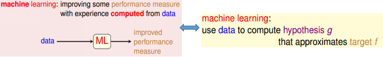
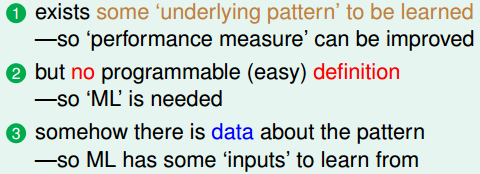
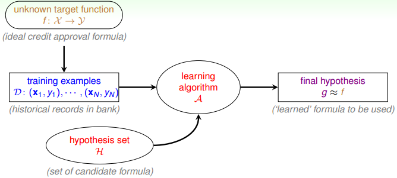
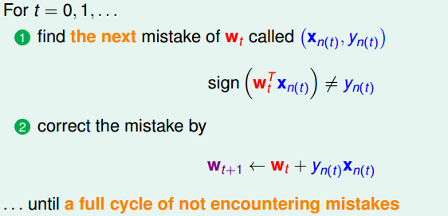
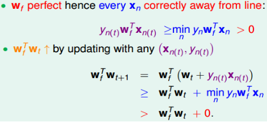
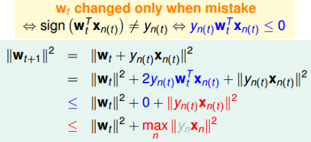

## 关于机器学习

### 定义及特点

基本定义：

判别问题是否适合采用机器学习的准则：

### 基本框架

## 0/1判别问题

注意这部分探讨的是0-1判别问题！

### 感知机算法

> Perceptron Learning Algorithm（PLA）

- 优点：实现简便，运行速度快
- 缺点：只能针对线性可分的数据集

### 感知机可行性分析（证明）

① $w_t$随着迭代次数$t$的增加而逐渐向$w_f$“靠拢”

后续推导用到的公式$w_f^Tw_{t+1}\ge w_f^Tw_t+min_ny_nw_f^Tx_n$（1）

② $w_t$的“靠拢”是逐渐的

后续推导用到的公式$||w_{t+1}||^2\leq ||w_t||^2+max_n||x_n||^2$（2）

③ 证明迭代次数有限：

由(1)可知：$w_f^Tw_{T}\ge w_f^Tw_{T-1}+min_ny_nw_f^Tx_n\ge...\ge w_f^Tw_{0}+T\cdot min_ny_nw_f^Tx_n$

由(2)可知：$||w_{T}||^2\leq ||w_{T-1}||^2+max_n||x_n||^2\le...\leq ||w_{0}||^2+T\cdot max_n||x_n||^2\to ||w_T||\le\sqrt{T}max_n||x_n||$

从而可以得到下式：
$$
\frac{w_f^Tw_T}{||w_f||\cdot||w_T||}\ge\frac{w_f^Tw_{0}+T\cdot min_ny_nw_f^Tx_n}{||w_f||\cdot||w_T||}\ge\frac{w_f^Tw_{0}+T\cdot min_ny_nw_f^Tx_n}{||w_f||\cdot\sqrt{T}max_n||x_n||}
$$
当$w_0=0$时：
$$
\frac{w_f^Tw_T}{||w_f||\cdot||w_T||}\ge\frac{T\cdot min_ny_nw_f^Tx_n}{||w_f||\cdot\sqrt{T}max_n||x_n||}\to T\le \frac{R^2}{\rho^2}
$$
其中$R^2=max_n||x_n||^2,\ \rho=min_ny_n\frac{w_f^T}{||w_f||}x_n$

因此得证。（其中利用到上式的左边$\leq1$）